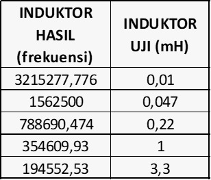

# Inductance-Meter

### Project 
- An inductance meter is a tool for measuring inductance, which is the property of an electronic component that stores energy in the form of a magnetic field when an electric current flows through it. Inductance is measured in units called henry (H). Inductance meters can be used to measure inductance in range 200mH-2H.
- In this project, an inductance measurement tool was created whose results will be displayed via the Blynk application
- This project was done by 4 people

### How it works? 
- The unknown test inductor is placed in parallel with the capacitor thereby creating an LC circuit. Once the voltage on the LC circuit becomes positive, the LM393 will float, which can be pulled high with a pull up resistor. When the voltage on the LC circuit becomes negative, the LM393 will pull its output to ground.
- A 5V pulse signal from the Arduino is applied to the LC circuit. These pulses will make the circuit resonate, producing a sinusoidal signal that oscillates at the resonant frequency. The frequency is measured and later using the formula we can get the inductance value. The resonant frequency is measured by the following equation:

  

- We can get the L value from the F frequency value we just measured and we also and the capacitor value. to get the value of L, we use this equation:

  

- The comparator converts the sine wave to a square wave with a 50% duty cycle. This measured value can  be doubled to determine the period, and the reciprocal of the period is the frequency. Since the circuit is in resonance, this frequency is the resonant frequency.
  
---
### Hardware Use
- ESP32 DEVKITC
- LM339N
- Diode 1N4007
- Resistor 150 ohm
- Resistor 330 ohm
- Capacitor 2 uF
  
### The Project Schematic

## The Hardware Design

### The Sasis Design

## Calibration
After the Inductor Meter Design is complete, calibration is carried out on the frequency of the test inductor that will be used. In this case, the test inductors used are 3.3 mH, 1 mH, 0.22 mH, 0.047 mH, and 0.01 mH inductors. The frequency was searched for each test inductor by repeating 10 times. The following is the frequency retrieval data for each inductor:

  

## The Test
After the equation model was entered into the program code, data was collected with 10 repetitions for each test inductor. The following is the data obtained:

## The Demo Result
 

## The Prototype
  

## The Conclusion:
An inductor meter is a tool used to measure or test the inductance value of an inductor. In this case, our designed inductor meter succeeded in measuring the test inductor in the range of 200 mH-2H and successfully displayed the value of the inductance which was read via the blynk application. The test results show that the highest error percentage value is for the 3.3mH test inductor at 8.987% and the smallest error percentage value is for the 0.22mH test inductor at 0.08%. However, several improvements are still needed regarding the error produced by the meter inductor.

